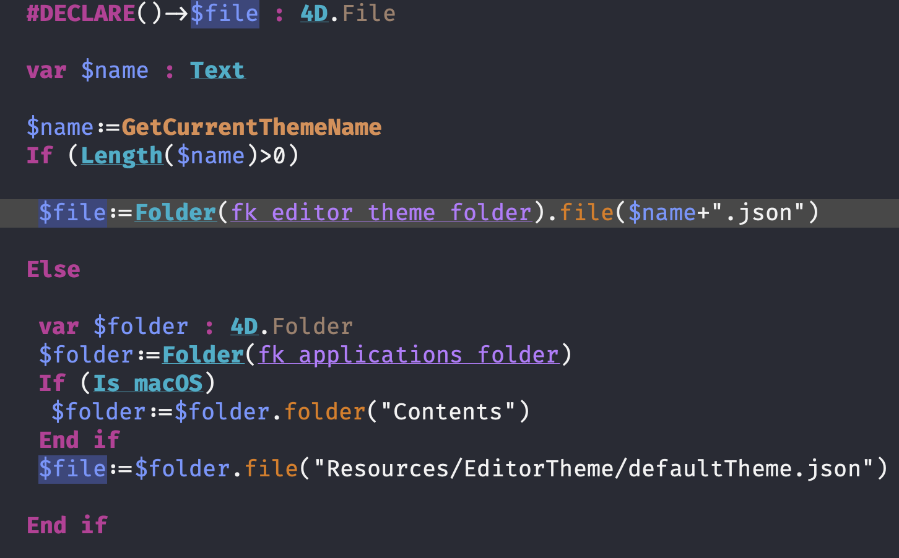

# MesopelagiqueTheme

* **Description**: Because I do not like space in constants or methods, I underline it.
* **Type**: dark theme
* **Font**: [Fira Code font](https://github.com/tonsky/FiraCode/releases)



## To install on macOS

Open a terminal and type

```bash
curl -sL https://raw.githubusercontent.com/mesopelagique/MesopelagiqueTheme/main/MesopelagiqueTheme.json -o $HOME/Library/Application\ Support/4D/4D\ Editor\ Themes/MesopelagiqueTheme.json
```

Then select it in 4D v19+ preferences.

## Others

### Convert any visual studio code theme to 4D theme

https://github.com/mesopelagique/VSThemeConverter

### Other components

[](https://mesopelagique.github.io/)
